### The Problem

The open-source frontend ecosystem is one of the most valuable yet under-monetized spaces in tech. Thousands of developers spend countless hours building high-quality UI components, design systems, and libraries that power products used by millions, yet receive little to no direct compensation.

Even within ecosystems like shadcn, where 100+ community registries exist, creators continuously ship premium-grade components for free. Despite the immense value being created, there is no native infrastructure that allows developers to monetize their work in a way that reflects real user demand.

---

### The Solution: HxUI Protocol

HxUI Protocol is a crowdfunding and governance protocol built on Solana, designed to turn open-source UI development into an incentive-aligned economy.

At its core, HxUI Protocol enables communities to directly fund and prioritize what gets built.

HxUI Protocol currently powers **[100xUI](https://www.100xui.com/)**, our premium shadcn-based component registry. Through this, users can influence the development roadmap in a completely permissionless way:

Users can purchase HxUI tokens or earn HxUI Lite tokens by adding 100xUI components via the shadcn CLI to their projects  
These tokens are used to vote on candidate components  
Multiple components compete for attention in an open market of demand

A component is only released if:

It secures the highest votes in the current cycle among competing candidates, with others rolling over to the next cycle. 
It surpasses a minimum vote threshold, ensuring fair developer compensation.

Because this runs on Solana, transactions are fast and cheap, making it easy for users to participate without friction.

HxUI aims to become the Gumroad for UI, where creators do not have to guess what will sell. Demand is visible upfront, and the community funds what it wants to see built.

## Quick Links

- **HxUI Program (Devnet Deployment)**  
  **[Solana explorer](https://explorer.solana.com/address/HLSeyqzgTyQZpUDqYZpo1sH1uJkE16gGRmRpvUmJRW7r?cluster=devnet)**

- **100xUI (Live Implementation)**  
  **[100xUI](https://www.100xui.com)** is a premium shadcn-based component registry.  
  HxUI Protocol for 100xUI is implemented at **[100xUI Vote component](https://www.100xui.com/vote-component)** (Devnet) to monetize the registry.

- **HxUI LiteSVM Test Sandbox (Replit)**  
  **[55 tests passed](https://replit.com/@yashwant2311046/hxui-tests)**. Run tests directly using the **Run** button after remixing the project.

<!-- - **Solana Playground (Isolated Test Case)**
  Vote receipt cleanup by candidate ID (isolated due to LiteSVM limitations). -->

- **HxUI Protocol Source Code (20+ instructions)**  
  **[Github](https://github.com/YashwantOstwal/hxui_program/)**

## Architecture Overview

HxUI Protocol is built as a set of on-chain instructions that manage the full lifecycle of a component, from creation to selection and release.

Below is a breakdown of the system through its core instructions.

### 1. `init_dui`

This instruction is invoked by the admin and acts as the bootstrapping step for the HxUI protocol. It is executed once to initialize all core program state accounts and token mints required for the system.

It sets up the following accounts:

**HxUI Config**  
Stores global program parameters such as the delegated `admin`, `tokens_per_vote`, and `price_per_token`, etc.

**HxUI Drop Time**  
Defines a future drop time (e.g., in days or weeks), after which a winner can be drawn from the active candidate components. It acts as a milestone to ensure users have sufficient time to participate before a component is chosen.

**HxUI Free Mint Counter**  
Tracks and enforces global rate limits for free HxUI Lite token minting.

**HxUI Mint**  
Initializes a HxUI Token-2022 mint used for paid HxUI tokens, which users purchase to vote on active candidate components.

**HxUI Lite Mint**  
Initializes the HxUI Lite Token-2022 mint used for free HxUI Lite tokens, distributed to users adding components via the shadcn CLI. Minting is rate-limited.

**HxUI Vault**  
A PDA that stores proceeds from HxUI token sales, which can later be withdrawn by the admin.

## 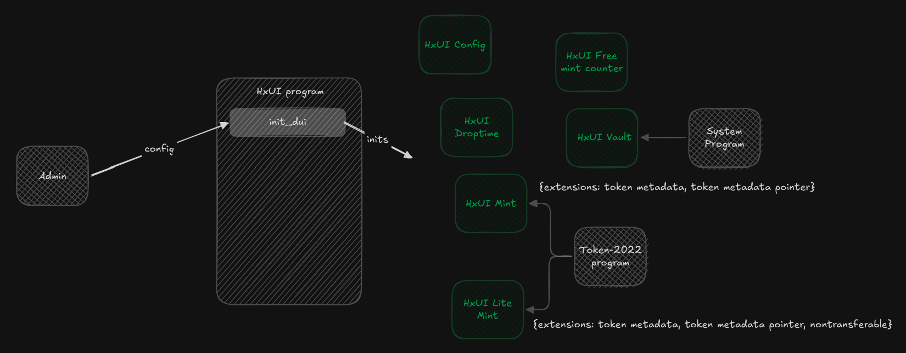

### 2. `set_drop_time`

This admin-only instruction defines a future drop time (e.g., in days or weeks), after which a winner can be drawn from the active candidate components.

Once the drop time has passed, a winner may be drawn using the `draw_winner` instruction by users or the admin via the [100xUI Voting Page](https://www.100xui.com/vote-component) , based on the highest number of votes among candidates that meet the minimum vote requirement.

The drop time acts as a milestone indicating when the system becomes eligible to select a winner; it does not restrict or stop voting. Users may continue to vote even after the drop time.

This instruction must be invoked before selecting a winner, ensuring users are informed in advance and have sufficient time to participate and influence outcomes.

No winner can be selected before the drop time. Once a winner has been drawn, the current cycle is considered complete, and a new drop time must be created to begin the next cycle. No additional winners can be selected within the same cycle.

## 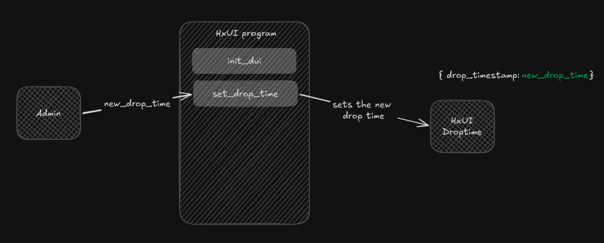

### 3. `create_candidate`

This instruction initializes a new candidate account containing the metadata of a proposed UI component. Once created, users can vote for this candidate using HxUI or HxUI Lite tokens, until its status is active.

**Candidate Account:**  
Stores all data related to the proposed component, including `name`, `description`, `vote_count`, its current `status`, etc.

A candidate can have one of these 3 statuses:

Active: The component is currently live and eligible to receive votes.

Winner: The component successfully won in one of the past drop cycles and must have already been released.

Withdrawn: The component is withdrawn by the admin, making it ineligible for further voting. Any HxUI tokens spent by users must be facilitated to be claimed back by the users.

## 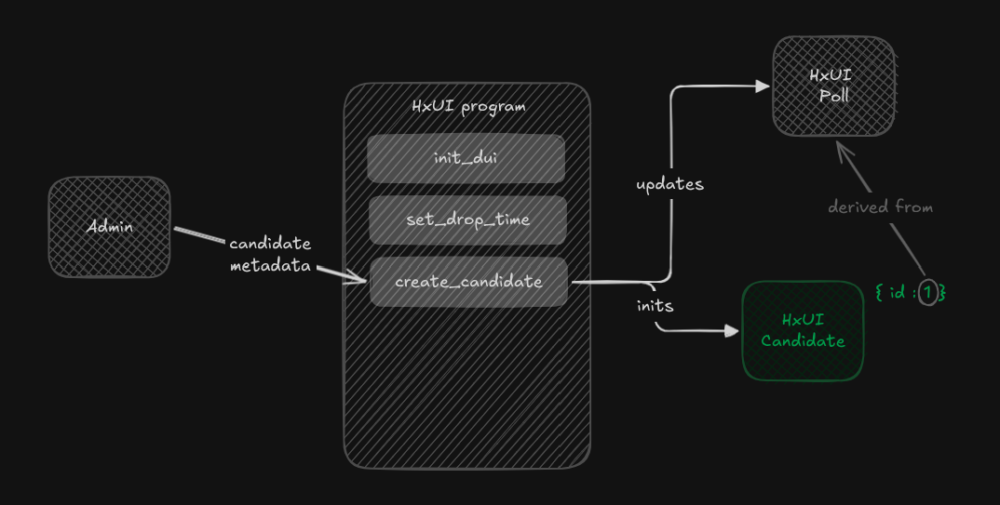

### 4. `buy_tokens`

This instruction allows users to purchase HxUI tokens by exchanging SOL. These newly minted tokens can then be used to cast votes for preferred active candidate components, helping influence the next drop.

## 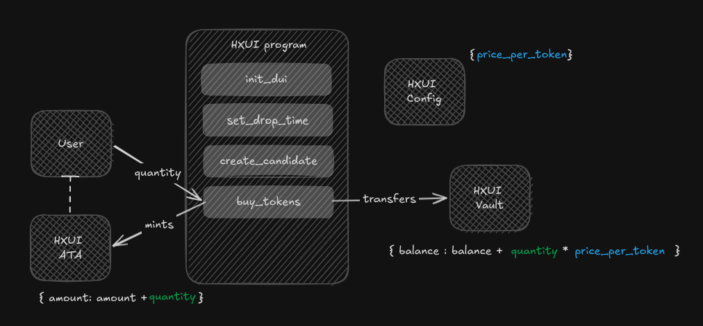

### 5. `vote_with_hxui`

This instruction allows users to cast one or more votes for active candidate components using purchased HxUI tokens. A user may allocate votes across any number of candidates.

When voting with HxUI tokens, the program will either create a new vote receipt account or update an existing one for the given user–candidate pair.

**Vote Receipt Account:**  
A vote receipt account tracks the total amount of HxUI tokens a user has spent on a specific candidate. There is exactly one vote receipt account per user per candidate.

The vote receipt account’s rent-exempt balance is funded by the HxUI vault, which holds the proceeds from HxUI token sales.

For more details, see: [Why receipt accounts exist](#why-receipt-accounts-exist)

## 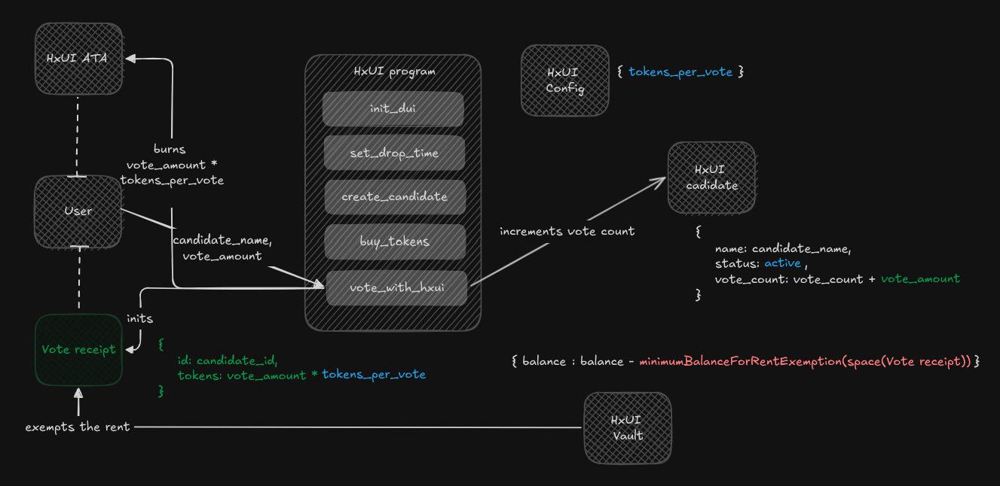

### 6. `register_for_free_mint`

This instruction allows users to register for minting free HxUI Lite tokens. It creates a Free Mint Tracker account to track the individual rate limit for minting free tokens per user.

**Free Mint Tracker Account:**  
This account stores the `next_mint_timestamp` and an `unregistered` boolean to manage a user’s eligibility for free minting. It ensures users can only mint after the allowed interval defined in the HxUI Config `free_mint_cooldown`, and tracks whether they have opted out of the free minting system.

## 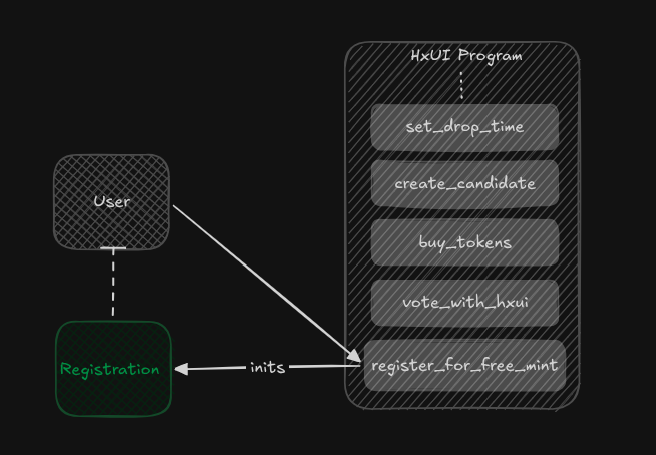

### 7. `mint_free_tokens`

This instruction is invoked when a user adds a [100xUI](https://www.100xui.com) component to their project using the shadcn CLI. It mints `free_tokens_per_mint` HxUI Lite tokens, as defined in the HxUI Config, to the user’s associated HxUI Lite token account (ATA). These tokens can then be used to vote on active candidate components.

Minting is permitted only if the following conditions are met:

- The user has an active Free Mint Tracker account (created during registration for free minting via [100xUI](https://www.100xui.com) ).
- The user has an associated HxUI Lite token account (ATA), which can be created during registration.
- The user has not exceeded the personal rate limit defined by their Free Mint Tracker account.
- The global minting limit has not been reached, as defined in the HxUI Config `free_mints_per_epoch`.

## 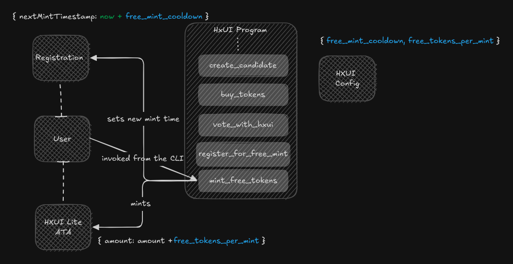

### 8. `vote_with_hxui_lite`

This instruction allows users to vote for an active candidate component using HxUI Lite tokens.

Unlike HxUI token voting, no vote receipt accounts are created when voting with HxUI Lite tokens.

## 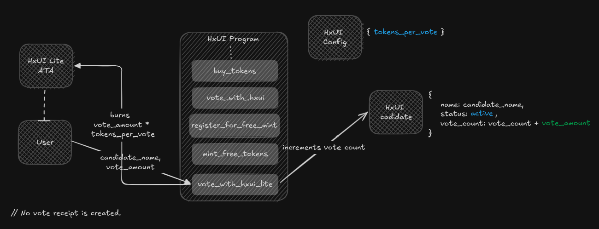

<!-- **Why separate mints for HxUI and HxUI Lite tokens?**
HxUI tokens represent paid participation and require precise accounting of user contributions, which is handled through vote receipt accounts. In contrast, HxUI Lite tokens are distributed for free and are designed for lightweight participation, avoiding additional account overhead.

**Example:**
A user votes with 1 HxUI token and 1 HxUI Lite token for the same candidate. The HxUI vote is tracked via a vote receipt account, while the HxUI Lite vote is counted directly without creating any additional account.
##  -->

### 9. `deregister_from_free_mint`

This instruction allows a user to deregister from minting free HxUI Lite tokens,

Once deregistered, the user is no longer eligible to mint free HxUI Lite tokens. They may also close their Free Mint Tracker account and claim the associated rent-exempt balance, but only after the cooldown period defined in the HxUI Config `free_mint_cooldown` from their most recent mint.

## 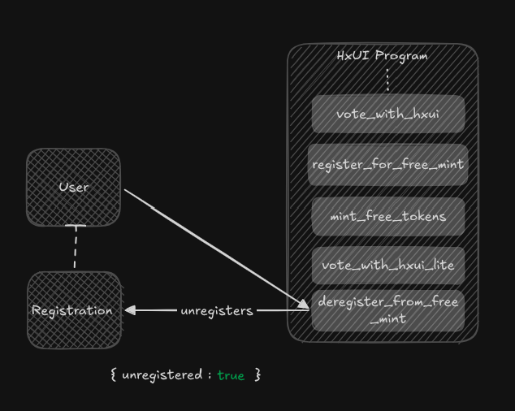

### 10. `cancel_deregister_from_free_mint`

This instruction allows a user to cancel a pending deregistration request.

Upon cancellation, the user regains eligibility to mint free HxUI Lite tokens by adding components.

## 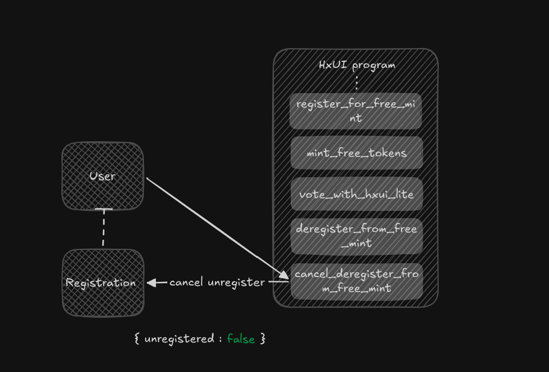

### 11. `claim_registration_deposit`

This instruction allows a user to close and claim the rent-exempt balance from their Free Mint Tracker account.

The balance can only be claimed after the user has deregistered and once the cooldown period defined in the HxUI Config `free_mint_cooldown` has passed since their most recent mint.

## 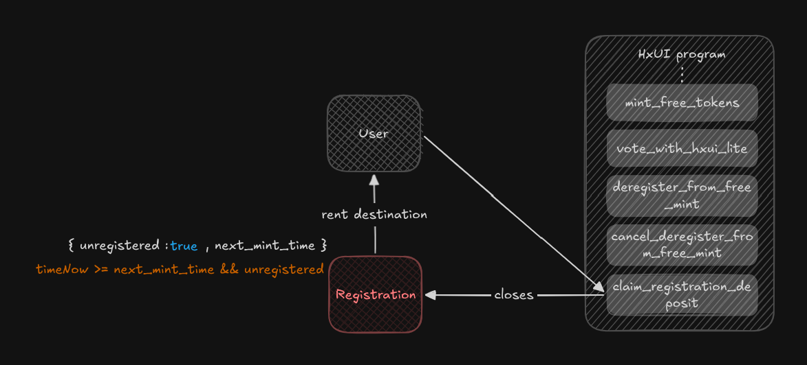

### 12. `draw_winner`

This instruction selects a winner based on the highest number of votes among active candidate components that meet the minimum vote requirement defined in the HxUI Config `min_votes_to_be_winner.

It can be invoked by users if the admin, but only after the `drop_timestamp` defined in the HxUI DropTime account has passed.

Once a candidate is selected as the winner, the corresponding component is expected to be dropped by the admin.

## 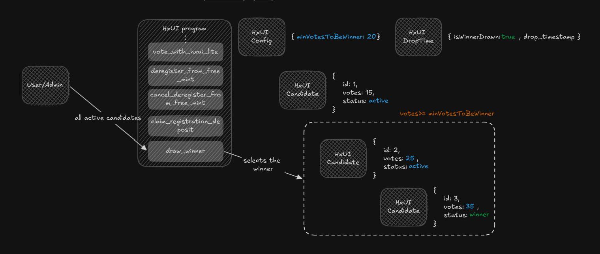

### 13. `withdraw_candidate`

This instruction allows the admin to remove an active candidate component. This action is expected to be used sparingly and only in exceptional cases, such as insufficient user traction or technical limitations in building the component.

If users have spent paid HxUI tokens voting for the withdrawn candidate, the admin must open a **claim-back window** using `open_claim_back_window` instruction for a considerable duration. During this period, users can reclaim their HxUI tokens using the `claim_back_tokens` instruction.

After the claim-back window has closed, users can no longer reclaim their tokens. The admin may then clean up any remaining (unclaimed) vote receipt accounts, transferring their rent-exempt balances back to the vault.

## 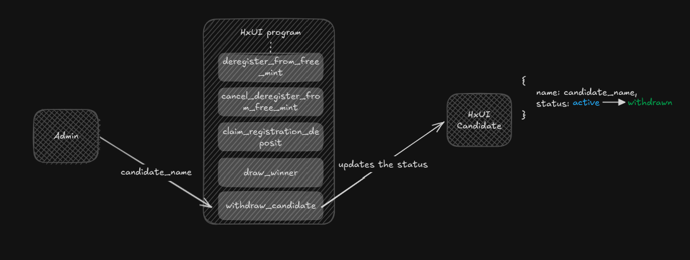

### 14. `open_claim_back_window`

### 15. `claim_back_tokens`

This instruction allows users to reclaim 100% of the HxUI tokens they spent on a candidate if that candidate is withdrawn. Tokens can only be claimed during the claim-back window opened by the admin. Invoking `claim_back_tokens` also closes the corresponding vote receipt account and returns the rent-exempt balance to the HxUI vault.

**Note:**

- Votes cast using HxUI Lite (free) tokens are not refundable, as no receipt accounts are created to track such usage.
- Vote receipt accounts cannot be closed by the admin until the claim-back window has closed.

## 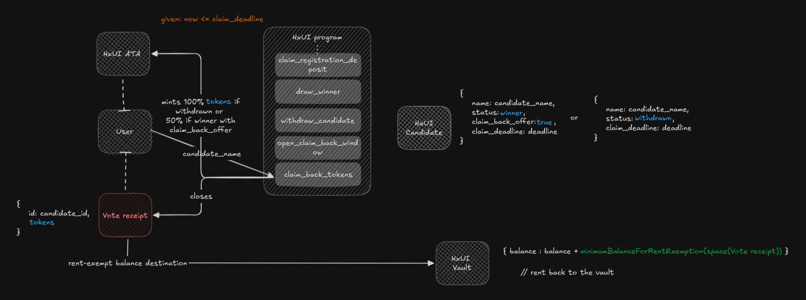

### 16. `enable_claim_back_offer`

This admin-only instruction allows the application of incentive mechanisms to a candidate component, instead of withdrawing it due to low traction.

Currently, the program supports a single offer type: **Claim back if winner.** Under this offer, users who vote for the candidate using paid HxUI tokens are eligible to reclaim **50% of the tokens** they have spent or will spend if the candidate is ultimately selected as the winner.

The claim-back process for this offer follows the same pattern as token recovery upon withdrawal, using the `claim_back_tokens` instruction.

Once this offer is applied to a candidate, **it cannot be reverted**.

## 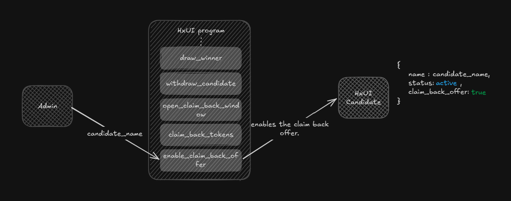

### 17. `close_vote_receipt`

This admin-only instruction is used to close vote receipt accounts associated with a non-active candidate. The admin can construct transactions with multiple `close_vote_receipt` instructions to clean up all vote receipt accounts for a given candidate.

Closing a vote receipt account transfers its rent-exempt balance back to the HxUI vault, which can later be withdrawn by the admin.

**When can vote receipt accounts be cleared:**

- Active candidate: Never.
- Winner candidate: Immediately after a winner is selected.
- Withdrawn candidate and winner with claim back offer enabled: Only after the claim-back window has been opened and subsequently closed.

### 18. `close_candidate`

This admin-only instruction is used to close a non-active candidate account, clearing all associated state and history for that candidate and reclaiming the rent-exempt balance back into the HxUI vault.

**Note:**

- Only a non-active candidate can be closed, and only if the candidate's vote receipt count (`receipt_count`) is 0.

<!-- Why receipt count required to be 0-->

### 19. `withdraw_vault_funds`

### 20. `update_config`

This admin-only instruction allows the admin to update program configuration parameters stored in the **HxUI Config** account, such as `pricePerToken` and `tokensPerVote` and to delegate a new admin.

## Milestones

- **Ship to Mainnet**  
  Complete audits, optimizations, and deploy the HxUI Protocol to Solana mainnet.

- **Help UI Creators Earn**  
  Empower UI libraries and 100+ shadcn registries to monetize their work through the HxUI Protocol on Solana.

- **Make Web3 Invisible for Users**  
  Onboard traditional Web2 users seamlessly into the Web3 ecosystem by upgrading 100xUI to use Privy’s embedded wallets.  
  _(100xUI already uses Privy for external wallet connections.)_

- **Grow the Ecosystem**  
  Expand adoption through developer communities and social channels.
